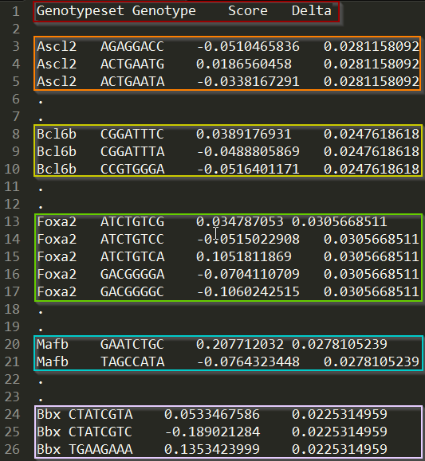

Genonets input-file format
==========================

The input file must be in the Tab Separated Value (TSV) format (columns are
separated by tabs). The first row must always comprise the column headers,
which are: :ref:`input_format_genotypeset`, :ref:`input_format_genotype`,
:ref:`input_format_score`, and :ref:`input_format_delta`. The parser is
agnostic to the order of the columns, but case-sensitive.

.. note::

    Missing values are not permitted in the Genonets input file format.

Column attributes
-----------------

Each row after the headers represents attributes of a single genotype. The
Genonets input file format requires that the following four attributes
(corresponding to the column headers) be defined for each genotype:

.. _input_format_genotypeset:

Genotypeset
^^^^^^^^^^^

Unique name/identifier of the genotype set to which the genotype belongs. A
genotype may fall within the intersection of multiple genotype sets. In this
case, the genotype must be specified in multiple rows, with one row
corresponding to one of the genotype sets. Then, the number of rows in which
the genotype appears would correspond to the number of genotype sets that
contain the genotype.

.. _input_format_genotype:

Genotype
^^^^^^^^

The genotype, as a sequence of letters from the required alphabet type. All
genotypes in the input file must be of the same alphabet type, and of equal
length.

.. _input_format_score:

Score
^^^^^

Quantitative phenotype value corresponding to the genotype. In cases where the
value is not available, it should be replaced by '0'.

.. _input_format_delta:

Delta
^^^^^

Noise associated with the quantitative phenotype data. The same delta value
must be used for all genotypes within the same genotype set, i.e., for all rows
with the same value for :ref:`input_format_genotypeset`. In cases where the
value is not available, it should be replaced by '0'.

Example
-------

Let us consider a concrete example by taking a look at the sample input file.
The sample input file contains data for five Mus transcription factors. Each
:ref:`input_format_genotype` is an 8nt long DNA sequence, which represents a
possible transcription factor binding site. The :ref:`input_format_genotypeset`
corresponding to the genotype is the name of the transcription factor that
binds the genotype. The :ref:`input_format_score` is the E-score, a measure of
the relative binding affinity of the transcription factor to the DNA sequence
[1]_ (i.e., genotype). Finally, the :ref:`input_format_delta` value is a measure of
experimental noise, in this case determined by comparing binding affinities on
two different microarray designs. When performing landscape related analyses
such as *Paths*, *Peaks*, and *Epistasis*, the score for each genotype is
considered as a range from :math:`Score-Delta` to :math:`Score + Delta`.

In the figure above, the first colored box shows the column headers. The
colored boxes that follow highlight parts of the genotype data for the five
genotype sets in the sample input file.

.. rubric:: References

.. [1] Michael F Berger et al. “Compact, universal DNA microarrays to
   comprehensively determine transcription-factor binding site specificities”.
   Nature Biotechnology 24, 1429 - 1435 (2006).