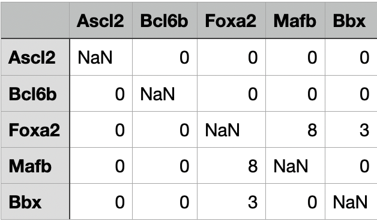

Result attributes
=================

The following types of result files are generated once all the requested
analyses have completed.

1. **Genotype_set_measures.tsv:**  All phenotype/genotype-set level results
   are reported in this file.
2. **<genotype-set-name>_genotype_measures:** All genotype-level results are
   reported in this file. The <genotype-set-name> is just a place holder for
   the name of the genotype-set whose genotypes are being reported. One file is
   generated per genotype-set.
3. **Genotype_set_overlap.tsv:** This file is organized as a symmetric matrix,
   where the first row and first column constitute names of all genotype sets
   being analyzed, all diagonal values are *NaN*, and each of the rest of the
   cells contains the No. of overlapping genotypes between the two genotype-
   sets represented by the corresponding row and column headers. The following
   figure provides an example:

4. **phenotype_network.gml:** The analysis_phenotype_network stored in GML
   format.
5. **<genotype-set-name>.gml:** The entire genotype network corresponding to
   *genotype-set-name* stored in GML format.
6. **<genotype-set-name>_dominant.gml:** The dominant genotype network
   corresponding to the *genotype-set-name* stored in GML format.
7. **Epistasis squares:** If the input parameter :ref:`store-epistasis-squares
   <args_store_epistasis_squares>` is enabled and epistasis analysis is used,
   all squares are written to disk. Four files are generated, where each file
   corresponds to one of the epistasis types, including 'no epistasis'. Once
   the analysis is complete, these files are compressed into a zip archive
   called :code:`epistasis_squares.zip`. The archive is available in the output
   directory.

The following sections describe the various output attributes.

Genotype-set-level results
--------------------------

Genotype-set-level results are written to :code:`Genotype_set_measures.tsv`. The
following table describes each output attribute. The *Attribute* column states
the name of the column as it appears in :code:`Genotype_set_measures.tsv`, the
*Analysis* column states the analysis that generates the attribute, and the
*Description* column describes the attribute.

.. list-table::
   :width: 200%
   :widths: 15 6 5 30
   :header-rows: 1

   * - Attribute
     - Analysis
     - Type
     - Description
   * - Genotype_set
     - Any
     - str
     - Name of the genotype set
   * - Robustness
     - :ref:`analysis_robustness`
     - float
     - Average robustness value computed for the genotype set.
   * - Evolvability
     - :ref:`analysis_evolvability`
     - float
     - Phenotype evolvability value computed for the genotype set.
   * - Evolvability_targets
     - :ref:`analysis_evolvability`
     - list
     - List of genotype sets accessible from this genotype set by a single
       mutation.
   * - Interface_edges
     - :ref:`analysis_evolvability`
     - dict
     - Counts for all possible types of external mutations. Each key in the
       dict is a genotype set name with another dict as the value. Keys for the
       nested dicts are mutation types with the corresponding counts as values.
   * - Accessibility
     - :ref:`analysis_accessibility`
     - float
     - Accessibility value computed for the genotype set.
   * - Neighbor_abundance
     - :ref:`analysis_neighbor_abundance`
     - float
     - Neighbor abundance value computed for the genotype set.
   * - Diversity_index
     - :ref:`analysis_diversity_index`
     - float
     - Diversity index value computed for the genotype set.
   * - Number_of_peaks
     - :ref:`analysis_peaks`
     - int
     - No. of peaks detected in the fitness landscape.
   * - Peaks
     - :ref:`analysis_peaks`
     - dict
     - Each key in the dict is an integral id assigned to a peak, and the
       corresponding value is a list of all genotypes that lie in this peak.
   * - Number_of_squares
     - :ref:`analysis_epistasis`
     - int
     - No. of squares found during epistasis analysis.
   * - Number_of_squares
     - :ref:`analysis_epistasis`
     - int
     - Total No. of squares found during epistasis analysis.
   * - Magnitude_epistasis
     - :ref:`analysis_epistasis`
     - float
     - Ratio of the number of squares characterized by magnitude epistasis, to
       the total number of squares in the genotype network.
   * - Simple_sign_epistasis
     - :ref:`analysis_epistasis`
     - float
     - Ratio of the number of squares characterized by simple sign epistasis,
       to the total number of squares in the genotype network.
   * - Reciprocal_sign_epistasis
     - :ref:`analysis_epistasis`
     - float
     - Ratio of the number of squares characterized by reciprocal sign
       epistasis, to the total number of squares in the genotype network.
   * - Summit
     - :ref:`analysis_peaks`
     - list
     - A list of all genotypes with highest :ref:`input_format_score` value.
   * - Ratio_of_accessible_mutational_paths
     - :ref:`analysis_paths`
     - dict
     - Each key in the dict is a path length, and the corresponding value is
       the ratio of accessible mutational paths of this length, to the total
       No. of paths of this length in the network.
   * - Ratio_of_overlapping_genotype_sets
     - :ref:`analysis_overlap`
     - float
     - Ratio of the number of overlapping genotype sets to the total number of
       genotype sets under consideration.
   * - Overlapping_genotype_sets
     - :ref:`analysis_overlap`
     - list
     - List of names of genotype sets, where each genotype set has at least one
       genotype in common with this genotype set.
   * - Number_of_genotype_networks
     - :ref:`analysis_structure`
     - int
     - Number of connected components, i.e., number of genotype networks within
       the genotype set.
   * - Genotype_network_sizes
     - :ref:`analysis_structure`
     - list
     - List of sizes of all genotype networks, i.e., connected components,
       within the genotype set.
   * - Size_of_dominant_genotype_network
     - :ref:`analysis_structure`
     - int
     - Size of the dominant genotype network, i.e., the giant component.
   * - Proportional_size_of_dominant_genotype_network
     - :ref:`analysis_structure`
     - float
     - Ratio of the No. of genotypes in the dominant network, to the total No.
       of genotypes in the entire genotype set.
   * - Edge_density
     - :ref:`analysis_structure`
     - float
     - Edge density of the genotype network.
   * - Average_clustering_coefficient_of_dominant_genotype_network
     - :ref:`analysis_structure`
     - float
     - Average clustering coefficient computed for the dominant genotype
       network.
   * - Assortativity
     - :ref:`analysis_structure`
     - float
     - Assortativity of the the genotype network.

Genotype-level results
----------------------

Genotype-level results are written to
:code:`<gentype-set-name>_set_measures.tsv`. The following table describes each
output attribute. The *Attribute* column states the name of the column as it
appears in :code:`<gentype-set-name>_set_measures.tsv`, the *Analysis* column
states the analysis that generates the attribute, and the *Description* column
describes the attribute.

.. list-table::
   :width: 200%
   :widths: 15 6 5 30
   :header-rows: 1

   * - Attribute
     - Analysis
     - Type
     - Description
   * - Sequence
     - Any
     - str
     - The genotype.
   * - Robustness
     - :ref:`analysis_robustness`
     - float
     - :ref:`analysis_genotype_robustness`.
   * - Evolvability
     - :ref:`analysis_evolvability`
     - float
     - :ref:`analysis_genotype_evolvability`.
   * - Evolvability_targets
     - :ref:`analysis_evolvability`
     - dict
     - Each key is the genotype-set name, and value is a list of genotypes in
       the genotype set to which the focal genotype can evolve.
   * - Evolves_to_genotypes_in
     - :ref:`analysis_evolvability`
     - list
     - List of names of the genotype sets to which this genotype can evolve.
   * - Overlaps_with_genotypes_in
     - :ref:`analysis_overlap`
     - list
     - List of names of the genotype sets which also contain this genotype.
   * - Shortest_path_length
     - :ref:`analysis_paths`
     - int
     - Length of the shortest path from this genotype to the summit.
   * - Shortest_accessible_path_length
     - :ref:`analysis_paths`
     - int
     - Length of the shortest accessible path from this genotype to the summit.
   * - Accessible_paths_from
     - :ref:`analysis_paths`
     - int
     - No. of accessible mutational paths from this genotype to the summit.
   * - Coreness
     - :ref:`analysis_structure`
     - float
     - Coreness is an alternative measure of mutational robustness.
   * - Clustering_coefficient
     - :ref:`analysis_structure`
     - float
     - The clustering coefficient measures the proportion of a vertex’s
       neighbors that are neighbors themselves.
